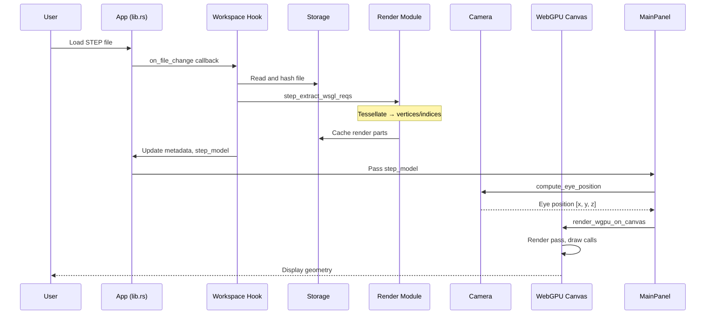
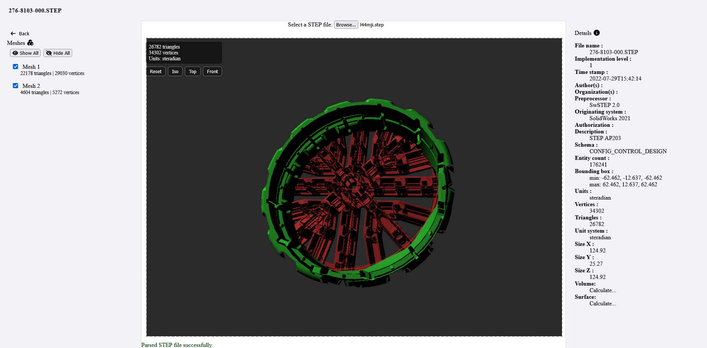
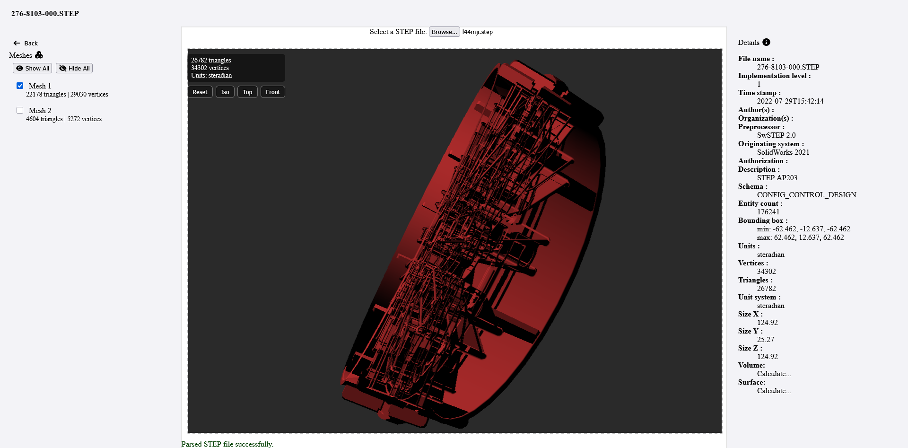
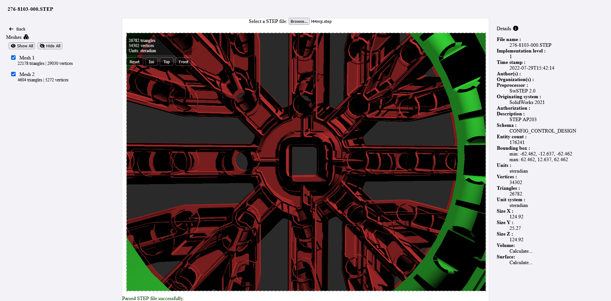

# StepViz

A WebAssembly-based 3D STEP file visualizer built with Rust and WebGPU. This tool parses and renders STEP files directly in the browser (CSR).

## Live Demo

=======>  https://mtb0x1.github.io/stepvisualizer/  <=======

## Current Status

This is an experimental project. The visualization works for basic STEP files but may fail or crash with complex models. Performance and stability are not guaranteed.

## Features

- Web-based 3D visualization of STEP files
- View part hierarchy and metadata
- WebGPU-accelerated rendering
- Works entirely in the browser (no server processing)



## Requirements

- A modern browser with WebGPU support : check https://caniuse.com/?search=webgpu
- Enable WebGPU in the browser (Chrome: chrome://flags/#enable-webgpu, Firefox: about:config -> webgl.webgpu.force-enabled)

## Getting Started

1. Install dependencies:
   ```bash
   cargo install trunk
   ```

2. Run the development server:
   ```bash
   trunk serve
   ```

3. Open `http://localhost:8080` in a modern browser

## Known Limitations

- Complex STEP files may cause crashs or rendering issues
- Large models may experience performance problems
- Some STEP file features may not be fully supported

## Dependencies

- Rust (latest nightly)
- wasm-bindgen
- wgpu (WebGPU implementation)
- truck-* crates for geometry processing
- and some more ... 

## TODO

- Tessellation : reduce precison to save memory and time.
- Tessellation : allow user to select preferred precision (this need to be in range of allowed tolerance)
- Few FIXME and TODO are in the code, some are critical.
- Add support for STEP file features that are not currently supported.
- Clean up :
   - panic should be replaced with error notification instead (on UI).
   - constants are in a separate file but not used.
   - deduplicate code (some are in common, some are in rendering, alot of repetitve patterns).
   - alot of `clone` and are most probably adding to perf issues.
   - regorg components to make it more maintainable.
   - some callbacks are not needed and/or triggred too often.
   - Alternative to Yew : less conveluted and more performant ?
   

## Screenshots



