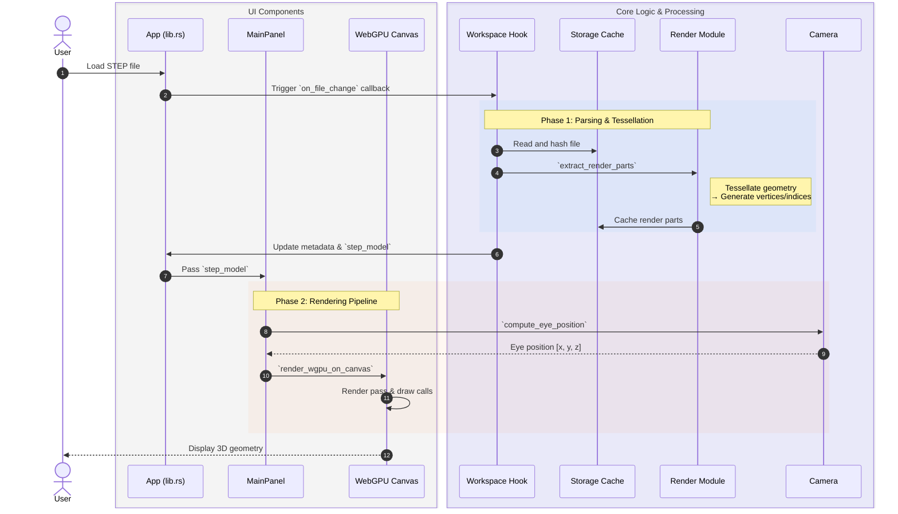

# StepVisualizer

A WebAssembly-based STEP file visualizer built with Rust and WebGPU. This tool parses and renders STEP files directly in the browser (Client Side Rendering).

## Live Demo

| Environment | URL | Updated on |
|---|---|---|
| Testing     | https://mtb0x1.github.io/stepvisualizer/testing/    | Push/PR `master`  -> `testing` merged |
| Production  | https://mtb0x1.github.io/stepvisualizer/production/ | Push/PR `testing` -> `release` merged |

A landing page at https://mtb0x1.github.io/stepvisualizer/ links to both environments.

To enable verbose tracing, append `?tracing=on&level=trace` to either URL and check the browser console.

## Current Status

This is an experimental project.

The visualization works for basic STEP files but may fail or crash with complex models. 

Performance and stability are not guaranteed.

## Supported STEP Formats

All files must be encoded as **ISO-10303-21** (the standard physical file format for STEP, `.stp` / `.step` extension).
The visualizer uses [`ruststep`](https://github.com/ricosjp/ruststep) for parsing and [`truck-stepio`](https://github.com/ricosjp/truck) for geometry extraction.
Support level depends on the `FILE_SCHEMA` declared in the file header.

> [!NOTE]
> The `samples/` directory intentionally includes files from **unsupported or partially-supported schemas**.
> They are provided so users can load them, observe the current behaviour, and help track what still needs work.
> Do not assume a file renders correctly just because it ships with the project.

| Schema / Standard | Common Name | ISO Code | Supported | Geometry rendered | Part hierarchy | Color from file | PMI / GD&T | Multi-body assemblies |
|---|---|:---:|:---:|:---:|:---:|:---:|:---:|:---:|
| `CONFIG_CONTROL_DESIGN` | AP203 (ed.1) | ISO 10303-203 | Yes | Yes | No | No* | No | ~ |
| `AUTOMOTIVE_DESIGN` | AP214 (ed.1–3) | ISO 10303-214 | Yes | Yes | No | Yes | No | ~ |
| `AP203_E2` / `CONFIGURATION_CONTROL_3D_DESIGN_ED2` | AP203 ed.2 | ISO 10303-203 | ~ | ~ | No | Yes | No | ~ |
| `AP242_MANAGED_MODEL_BASED_3D_ENGINEERING` | AP242 | ISO 10303-242 | ~ | ~ | No | Yes | No | ~ |
| `FEATURE_BASED_PROCESS_PLANNING` | AP224 | ISO 10303-224 | No | No | No | No | No | No |
| `STRUCTURAL_ANALYSIS_DESIGN` / AP209 | AP209 | ISO 10303-209 | No | No | No | No | No | No |
| `PLANT_SPATIAL_CONFIGURATION` | AP221 | ISO 10303-221 | No | No | No | No | No | No |
| `SHIP_STRUCTURES_SCHEMA` | AP218 | ISO 10303-218 | No | No | No | No | No | No |

> **Yes** Supported, **~** Partial, **No** Not supported  
> \* *AP203 ed.1 (`CONFIG_CONTROL_DESIGN`) does not define presentation/color entities in its schema standard; fallback palette is used.*

### Feature Notes

**What works (AP203 / AP214):**
- B-Rep solid geometry (BSpline surfaces, planes, cylinders, cones, tori, …) is tessellated via `truck`'s triangulation pipeline.
- Surface and part colors: extracted from presentation styles (`STYLED_ITEM`, `OVER_RIDING_STYLED_ITEM`, `COLOUR_RGB`, `DRAUGHTING_PRE_DEFINED_COLOUR`, `SURFACE_STYLE_USAGE` / `SURFACE_STYLE_RENDERING_WITH_PROPERTIES`) and rendered per-part in WebGPU and the hierarchy/meshes panel; fallback deterministic cycling palette is applied when colors are absent.
- Basic header metadata is displayed (filename, timestamp, author, schema, entity count, bounding box, units).
- Volume and surface area can be computed on demand from the tessellated mesh.
- Files with multiple `DATA` sections are processed (all usable sections are merged).
- Unit systems: `SI_UNIT` prefixes (`mm`, `cm`, `m`, `km`) and `CONVERSION_BASED_UNIT` (`inch`, `foot`) are recognized.

**Known gaps even for supported schemas:**
- **Part/assembly hierarchy**: the product tree (`PRODUCT`, `NEXT_ASSEMBLY_USAGE_OCCURENCE`, …) is not parsed - each shell is treated as a flat, independent part.
- **Complex appearance & textures**: Face-level texture coordinates, PBR textures, and advanced optical material properties (e.g. subsurface scattering, refraction index) are not parsed; diffuse surface color and alpha transparency are supported.
- **PMI / GD&T annotations**: datum targets, geometric tolerances, and annotation planes are ignored.
- **2D geometry**: `GEOMETRIC_CURVE_SET` and wire-body entities produce no triangles and are silently skipped.
- **Complex shells**: shells that fail `truck`'s compression step are skipped with a warning; the rest of the file is still rendered.
- **Large files**: files larger than the configured limit are rejected; very large models may be slow or cause the browser tab to run out of memory.

**Why AP224 / AP209 / AP218 / AP221 are not supported:**
These schemas contain domain-specific entity types (machining features, FEA meshes, piping layouts, ship structure panels) that have no geometry representation in `truck-stepio`'s `Table`. The parser accepts the ISO-10303-21 envelope but produces zero renderable shells.

## Features

- Web-based 3D visualization of STEP files
- View part hierarchy and metadata
- WebGPU-accelerated rendering
- Works entirely in the browser (no server processing)


```mermaid
sequenceDiagram
    autonumber
    actor User
    
    box rgba(200, 200, 200, 0.1) UI Components
    participant App as App (lib.rs)
    participant MainPanel as MainPanel
    participant Canvas as WebGPU Canvas
    end
    
    box rgba(100, 100, 255, 0.1) Core Logic & Processing
    participant Workspace as Workspace Hook
    participant Storage as Storage Cache
    participant Render as Render Module
    participant Camera as Camera
    end

    User->>App: Load STEP file
    App->>Workspace: Trigger `on_file_change` callback
    
    rect rgba(0, 150, 255, 0.05)
    Note over Workspace,Render: Phase 1: Parsing & Tessellation
    Workspace->>Storage: Read and hash file
    Workspace->>Render: `extract_render_parts`
    Note right of Render: Tessellate geometry<br/>→ Generate vertices/indices
    Render->>Storage: Cache render parts
    end
    
    Workspace->>App: Update metadata & `step_model`
    App->>MainPanel: Pass `step_model`
    
    rect rgba(255, 100, 0, 0.05)
    Note over MainPanel,Canvas: Phase 2: Rendering Pipeline
    MainPanel->>Camera: `compute_eye_position`
    Camera-->>MainPanel: Eye position [x, y, z]
    MainPanel->>Canvas: `render_wgpu_on_canvas`
    Canvas->>Canvas: Render pass & draw calls
    end
    
    Canvas-->>User: Display 3D geometry
```

## Requirements

- A modern browser with WebGPU support : check https://caniuse.com/?search=webgpu
- Enable WebGPU in the browser (Chrome: chrome://flags/#enable-webgpu, Firefox: about:config -> webgl.webgpu.force-enabled)

## Getting Started

1. Install prerequisites:
   ```bash
   rustup target add wasm32-unknown-unknown
   cargo install trunk
   ```

2. Run the development server:
   ```bash
   trunk serve
   ```

   or build the standalone WASM bundle (use `./` for local dev, a sub-path for subdirectory deployments):
   ```bash
   trunk build --release --public-url ./
   ```

3. Open `http://localhost:8080` in a WebGPU-capable browser

## Running Tests

Tests run in a freestanding `wasm32-unknown-unknown` browser environment with WebAssembly SIMD (`+simd128,-relaxed-simd`) enabled via `wasm-pack test`:

```bash
# Headless Chrome / Chromium (Local & CI/CD)
wasm-pack test --headless --chrome --release

# Or using Firefox
wasm-pack test --headless --firefox --release
```

### Example Files

The `samples/` directory ships with a variety of real-world STEP files spanning multiple schemas.
Not all of them render correctly. They serve as a test bed to explore current support and surface gaps.

## Known Limitations

- Complex STEP files may cause crashes or rendering issues
- Large models may experience performance problems
- Some STEP file features may not be fully supported

## Dependencies

- Rust (latest nightly)
- wasm-bindgen
- wgpu (WebGPU implementation)
- truck-* crates for geometry processing
- and some more ... 

## TODO

- Unit tests for the pure logic (math, caches, parsing, mesh metrics).
- Add support for STEP file features that are not currently supported.
- Clean up:
   - a lot of `clone` calls, most probably adding to perf issues.
   - some callbacks are not needed and/or triggered too often.
   - Alternative to Yew: less convoluted and more performant ?
   

## Benchmarking & Performance Regression Testing

An end-to-end hot-path benchmark suite is available in [`misc/benchmarks`](misc/benchmarks). It measures execution time and memory footprint (WASM linear memory and WebGPU buffer allocations) across the complete loading, parsing, tessellation, and rendering pipeline using `samples/l44mji.step` as baseline.

For instructions on building and running the automated headless WebGPU benchmark, see [`misc/benchmarks/README.md`](misc/benchmarks/README.md).